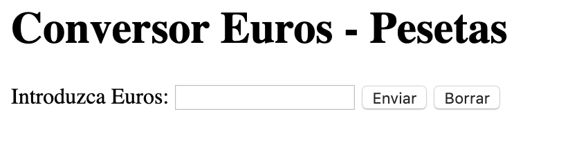
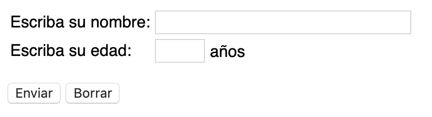

# Conociendo el Lenguaje Php (V)
###  Formularios
  
#### Actividad 1
Realiza un programa que que reciba dos parámetros numéricos por **queryString** y muestre el resultado de su multiplicación

```php
   http://localhost:8000/actividad1/index.php?num1=2&num2=6
```
```php
   <?php
        $num1 = $_GET['num1'];
        $num2 = $_GET['num2'];
        $resultado = $num1 * $num2;
        
        echo "<p> $num1 X $num2 = $resultado </p>";
   ?>
```

#### Actividad 2
Realiza un conversor de euros a pesetas, la cantidad en euros que se quiere convertir se deberá introducir a través de queryString.
```php
   http://localhost:8000/actividad2/index.php?euros=250
```
**Nota:** 1€ = 166.386 pesetas

#### Actividad 3
Escribe un programa que a partir de 2 variables ``base`` y `altura` introducidas mediante queryString, lo dibuje y 
calcule su area
```php
   http://localhost:8000/actividad3/index.php?base=50&altura=20
```

#### Actividad 4
A. Repite el ejercicio anterior, pero en este caso si no se especifica el parámetro ``base``, este será un número aleatorio.
Utiliza la función [isset()](https://www.php.net/manual/es/function.isset.php)

```php
   http://localhost:8000/actividad3/index.php?base=50&altura=20
```
```php
   <?php
        if (!isset($_GET['base'])){
            //Acción a realizar cuando no se especificado el parámetro
        }
```
B. Crea un fichero ``indexB.php`` y repite el ejercicio utilizando el **operador ternario**
```php
   <?php
       $base = (predicado) ? "Valor condición true" : "Valor condición false";
       $mensaje = (edad > 18) ? "Es mayor de edad" : "No es mayor de edad";
```

#### Actividad 5
Escribe un programa que a partir de 1 parámetro `num1` btenido por queryString, indique si se trata de un número entero,
un número decimal o una cadena.

[is_int()](https://www.php.net/manual/es/function.is-int.php),
[is_float()](https://www.php.net/manual/es/function.is-float.php)
[is_numeric()](https://www.php.net/manual/es/function.is-numeric.php)
**Ayuda**: Todo dato obtenido por queryString vendrá como una cadena. Una estrategia para convertirlo a numérico es comprobar
si se trata de un dato numérico, en caso afirmativo convertir la cadena a su correspondiente tipo nativo (float, int) sumándole un 0
**DuckTyping**

#### Actividad 6
Escribe un programa que muestre la suma, resta, multiplicación, división, preincremento y postincremento de dos números 
introducidos por queryString.

Crea un fichero ``indexB.php`` y realiza las siguientes acciones:
- Si no existe alguno de los parámetros esperados muestra un mensaje de alerta y no realices ninguna acción
- Si los números no son iguales indica el mayor
- Comprueba que sean datos numéricos, en caso contrarios muestra un mensaje de alerta y finaliza la ejecución ``exit()``.
  
### Obtención de información del cliente en 2 pasos
#### Actividad 7
- Repite el **ejercicio 2** pero en este caso los datos deberán ser introducidos mediante un formulario que deberá ir en un fichero
``index.html`` independiente.


    
- Asegúrate de comprobar la existencia de los parámetros

#### Actividad 8
Crea un formulario que recoja los datos de un usuario nombre y edad. A continuación crea una página ``procesa.php`` que acceda a dichos datos 
y los muestre por pantalla. Además deberá indicar si el usuario es mayor de edad o no.



#### Actividad 9
- Crea una página ``index.php`` con un formulario que pida al usuario un día de la semana ``[lunes|martes|miercoles|jueves|viernes]`` y una hora ``[1,2,3,4,5,6]``.
- Crea otra página ``procesa.php`` que diga qué asignatura toca ese día.
Los datos estarán almacenados en un array multidimensional.
```php
   <?php
       $horario = [
            "lunes" => ["ASO", "IAW", ...]   
       ];
```
Crea un fichero ``procesaB.php``y realiza las siguientes opciones:
- Refactoriza el programa anterior para que si no existe el parámetro ``hora``, muestre la asignatura que toca a primera hora.
- En caso de que no exista el parámetro ``dia`` debe mostrar un mensaje de error y finalizar la ejecución.


#### Actividad 10
Escribe un programa que nos diga el horóscopo a partir del día y mes de nacimiento introducidos mediante un formulario.
En caso de que no existan los parámetros, redirigiremos al usuario a la página inicial 
del formulario. Utiliza la función [header()](https://www.php.net/manual/es/function.header.php)

```php
   <?php
     header('Location: index.html');
     exit();
```


#### Actividad 11
- Crea una página ``index.php`` que contenga un formulario en el que a través de un control de tipo ``select`` muestre los nombres representativos
 de cada una de los animales presentes en el directorio ``assets/images/animales``. Estos deberán estar almacenados en un array.

```php
    <?php
 $listadoAnimales = [
     [
         "nombre" => 'ballena',
         "imagen" => 'ballena.svg'
     ],
     ...
  ];
```
- Crea una página ``procesa.php`` en el que recojan los datos del animal seleccionado y se muestre la imagen junto al 
nombre del animal.
Utiliza la sentencia [require_once("nombre_archivo")](https://www.php.net/manual/es/function.require-once.php) Para no repetir el array
tal y como se muestra en la plantilla de la actividad.


#### Actividad 12 
- Crea un documento `index.php` en el que se encuentre formulario que recoja los datos personales de un usuario; nombre, dni,
email, ciudad, provincia, pais, fecha de nacimiento.
- En cuanto al pais será un seleccionable con las siguientes opciones (España | Francia | Portugal)
- Podremos seleccionar un tipo de usuario perteneciente a: ``empresa, autònomo, particular``.
- Debe seleccionar diferentes areas de interés pertenecientes al siguiente subconjunto: `deportes, cine, juegos, internet,
libros o cultura``.
- Crea un 2do archivo `procesa.php` en el que se muestren todos los datos introducidos.
- Recuerda mostrar una lista con todos los posibles parámetros de entrada que no se hayan completado en el formulario. Estos parámetros
deberán ir en una lista ordenada ``<ul><li><li></ul>``

**Ayuda:** Puedes hacer uso de la funcion [implode()](https://www.php.net/manual/es/function.implode.php) al recoger los datos
de los intereses del usuario.

 
#### Actividad 13
Realiza un minicuestionario con 10 preguntas tipo test sobre las asignaturas que se imparten en el curso. Cada pregunta 
acertada sumará un punto. El programa mostrará al final la calificación obtenida. Pásale el minicuestionario a tus compañeros 
y pídeles que lo hagan para ver qué tal andan de conocimientos en las diferentes asignaturas del curso.

### Obtención de información del cliente en 1 paso

#### Actividad 14
Realiza un programa que diga si un número introducido por teclado es par. Tanto la entrada de datos como el procesamiento se
llevará a cabo en el mismo documento php.

```php
   <?php
     if (isset($_GET['num'])){
         
         //procesamos el formulario
         
     } else {
         
         //mostramos el formulario
         
     }
```
#### Actividad 15 
Muestra la tabla de multiplicar de un número introducido mediante un formulario. 
El resultado se debe mostrar en una tabla ``<table>``

#### Actividad 16
Realiza una página en **PHP** que pida al usuario una nota y muestre su correspondiente valor en la siguiente escala:

- Si la nota es menor que 5 -> “suspenso”
- Si la nota es 5 -> “aprobado”
- Si la nota está entre 6 y 7 -> “bien”
- Si la nota está entre 8 y 9 -> “notable”
- Si la nota es 10  -> “sobresaliente”

**Nota:** Las notas < que 5 deben aparecer coloreadas en rojo y las mayores que 5 en verde.
Tanto el formulario como su procesamiento deben estar en un único documento ``index.php``

#### Actividad 17
Realiza el control de acceso a una caja fuerte. La combinación será un número de 4 cifras.
El programa nos pedirá la combinación para abrirla, si no acertamos, se nos mostrará el mensaje “Lo siento, esa no es la combinación” 
y si acertamos se nos dirá “La caja fuerte se ha abierto satisfactoriamente”.
Los datos se pedirán y procesarán en una misma página a través de un formulario.

#### Actividad 18
Crea una página ``login.php`` Èn la que recojas el nombre de usuario (email) y la contraseña.
Crea una seguna página ``procesa.php`` en la que, si el usuario y la contraseña coinciden con alguna de la credenciales mostradas
en la siguiente tabla, aparecerá por pantalla y en color verde "logueado", en caso contrario debe aparece 
otra vez el formulario con el texto "Usuario o password incorrecto".

| Usuario | Password |
|---|---|
| alumno1@iaw.local | 4lumn01  |
| alumno2@iaw.local | 4lumn02  |
| alumno3@iaw.local | 4lumn03  |

Además, debes tener en cuenta las siguientes condiciones:
* Si alguno de los campos requeridos no existe deberás redireccionar a la página inicial
* El email instroducido debe ser válido. Utiliza la funcion [filter_var()](https://www.php.net/manual/en/function.filter-var.php) 
```php
   <?php
     if (filter_var($email, FILTER_VALIDATE_EMAIL)){
     
     }
```
* La contraseña debe tener entre 6 y 10 caracteres. [strlen()](https://www.php.net/manual/es/function.strlen.php)
**Nota** Utiliza para cada **input** el tipo más adecuados para el dato que debe albergar

###  Inclusión de ficheros
#### Actividad 19
A partir de los ficheros ``cabecera.html, body.html y footer.html`` crea un fichero ```index.php``` que muestre la página resultante de su combinación.

#### Actividad 20
- Crea un fichero ```procesa_animales.php``` que incluya el array de animales `animales.php` y muestre el nombre y la imagen de cada animal.
- Crea un fichero ```procesa_animales_pares.php``` que incluya el array de animales `animales.php` y muestre solo el nombre de los animales
cuya posición dentro del array (índice) sea par.
- Crea un fichero ```procesa_animales_tierra.php``` que muestre el nombre y la imagen de todos los animales que vivan en la tierra.
- Crea un fichero ```procesa_animales_mar.php``` que muestre el nombre y la imagen de todos los animales que vivan en el mar.

#### Actividad 21 - Ayuda Proyecto
Refactoriza el **ejercicio 18** para que solo se utilice una página en la validación del formulario. La [siguiente guía](cheat_sheet_validación_de_formulario_guiada.md) te será de ayuda


